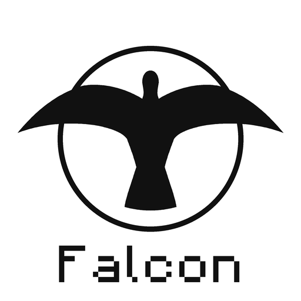

<p align="center">
	<picture>
		<source media="(prefers-color-scheme: dark)" srcset=".github/logo-white.png">
		
	</picture>
	<br>
	<b>Minecraft: Bedrock Edition server software written from scratch in C++</b>
	<br>
	Not affiliated with Mojang AB.
</p>

<p align="center">
	<a href="https://falcon-mc.github.io"></a>
	<a href="https://github.com/Falcon-MC/Falcon/actions/workflows/ci.yml"></a>
	
	
	
	
</p>

## What is this?

Falcon is a Minecraft: Bedrock Edition server built from the ground up in C++17. It does not derive
from any existing server: the protocol, world storage, inventory, movement and gameplay systems are
all reimplemented by hand, with vanilla behavior as the reference.

- **Native** - no runtime to install, the server ships as a single self-contained executable
- **Vanilla worlds** - Bedrock world format, so worlds move between Falcon and the game unchanged
- **Behavior packs** - custom content and a JavaScript scripting API loaded from packs

## Getting started

Download the latest Windows or Linux build from the [releases](https://github.com/Falcon-MC/Falcon/releases),
check it against its `.sha256` file and run it. On the first start, a setup wizard in the console writes
`server.properties`.

## Supported versions

| Minecraft | Protocol |
|-----------|----------|
| 1.26.60   | 2216     |

## Related repositories

- [Protocol](https://github.com/Falcon-MC/Protocol) - packets and network types
- [Network](https://github.com/Falcon-MC/Network) - RakNet and NetherNet transport
- [NBT](https://github.com/Falcon-MC/NBT) - NBT tags and binary streams
- [BedrockData](https://github.com/Falcon-MC/BedrockData) - game data files, versioned by protocol
- [BlockStateUpdater](https://github.com/Falcon-MC/BlockStateUpdater) - block state upgrade schemas
- [leveldb](https://github.com/Falcon-MC/leveldb) - LevelDB with the zlib compression used by Bedrock worlds
## Building

Falcon needs CMake 3.16+, a C++17 compiler, zlib and OpenSSL. On Windows the reference toolchain is
MSYS2 UCRT64.

```
cmake -B build -G Ninja
cmake --build build
```

## Give a star if this project helped you

[](https://github.com/Falcon-MC/Falcon/graphs/contributors)

## Licensing information

Falcon is licensed under the [GNU Lesser General Public License v3.0](LICENSE), which supplements the
[GNU General Public License v3.0](COPYING). You may use, modify and redistribute it, as long as changes to
Falcon itself stay under the same license.

Falcon is not affiliated with Mojang. All brands and trademarks belong to their respective owners.
Falcon is not a Mojang-approved software, nor is it associated with Mojang.
